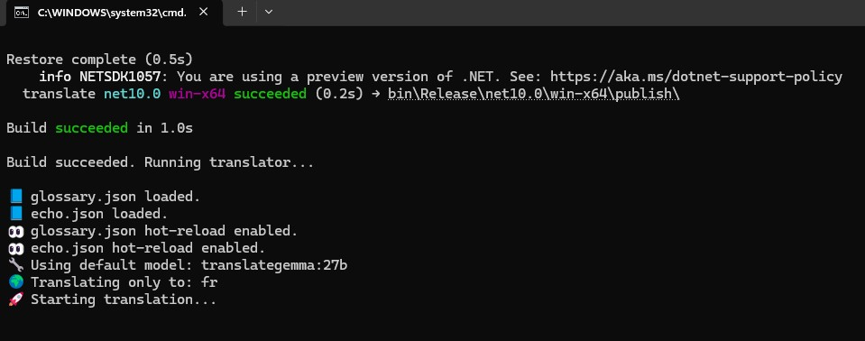

<h1>ResxForge</h1>

<strong>Deterministic, glossary-aware localization pipeline for <code>.resx</code> files powered by local LLMs (via Ollama).</strong>

ResxForge automates translation of .NET resource files while maintaining control, consistency, and UI-safe rules.

<h2>Why ResxForge?</h2>

Traditional LLM translation workflows often lack the guardrails needed for production software. ResxForge adds:

<ul>
<li>🔒 Key-level overrides for manual precision.</li>
<li>📘 Language-specific glossaries with live hot-reload.</li>
<li>🚫 No-Translate Protection: Define specific keys or values to skip entirely.</li>
<li>🔁 Per-language cache system for deterministic re-runs.</li>
<li>🔍 English echo detection and script leakage validation.</li>
<li>🔢 Language-aware numeric formatting (e.g., 180°C, 10%).</li>
<li>⚡ Automatic Ollama bootstrapping and model management.</li>
<li>📝 Translation review logging (review.log).</li>
<li>🧹 Hallucination Protection: Automatic detection and cleaning of "list dumps" or conversational AI chatter.</li>
</ul>

<h2>Hardware Optimization</h2>
<blockquote>
<strong>⚠️ CPU-Only Optimized:</strong> This implementation is specifically tuned for CPU inference. It is benchmarked and optimized for a <strong>Core i7-10700 with 64GB RAM</strong> (e.g., Dell Optiplex 3080 setup).
</blockquote>
<ul>
<li><strong>Smart Memory Purge:</strong> The pipeline triggers an automatic <code>keep_alive: 0</code> model unload and system stabilization delay between folder batches to prevent context saturation and thermal throttling.</li>
<li><strong>AVX2 Utilization:</strong> Optimized for local Ollama runners utilizing CPU-bound instruction sets.</li>
<li><strong>Aggressive Context Management:</strong> Resets the "AI Brain" after every language loop to maintain high accuracy without dedicated VRAM.</li>
</ul>

<h2>Requirements</h2>
<ul>
<li><strong>.NET 10.0:</strong> Ensure you have the latest .NET SDK installed (Matches the <code>ResxForge.csproj</code>).</li>
<li><strong>Ollama for Windows:</strong>
 1. Download from <a href="https://ollama.com/download/windows">ollama.com/download/windows</a> and run the installer.
 2. <strong>Note:</strong> The installer automatically handles the <code>PATH</code> setup for you.
 3. To verify it's ready, open a terminal and type: <code>ollama --version</code>
</li>
<li><strong>Model Preparation:</strong> Before running ResxForge, download the necessary "brains" via terminal:
<pre><code>ollama pull translategemma:27b
ollama pull aisingapore/sea-lion-v4-27b-it</code></pre>
</li>
</ul>

<h2>Getting Started</h2>

If you are new to local AI tools, just follow these three steps:

<ol>
<li><strong>Verify Ollama:</strong> Make sure the Ollama icon (the llama face) is visible in your Windows System Tray (near the clock).</li>
<li><strong>Set Your Folders:</strong> Open <code>Program.cs</code> and update these lines with your actual folder paths:
<pre><code>private const string ResxFolder = @"C:\YourPath\Resources";
private const string ConfigFolder = @"C:\YourPath\config";
private const string CacheFolder = @"C:\YourPath\cache";</code></pre>
</li>
<li><strong>Run the Forge:</strong> Open a terminal in the project directory and run:
<pre><code>dotnet run</code></pre>
</li>
</ol>

<em>Tip: The first run might look like it's "stuck" for a minute—that is just your i7 loading the 15GB model into your 64GB RAM. Check the logs for the 🧠 icon!</em>

<h2>First-Time Setup</h2>
<ol>
<li><strong>Install Ollama:</strong> Use the link above. Ensure the Ollama icon is visible in your system tray.</li>
<li><strong>Configure Paths:</strong> Open <code>Program.cs</code> and point the <code>ResxFolder</code>, <code>ConfigFolder</code>, and <code>CacheFolder</code> to your local project directories.</li>
<li><strong>Hardware Check:</strong> On first run, ResxForge will verify your CPU's <strong>AVX2</strong> support (optimized for i7-10700 series).</li>
<li><strong>Run:</strong> Open a terminal in the project folder and type:
<pre><code>dotnet run</code></pre>
</li>
</ol>

<h2>Usage</h2>
<h3>Basic</h3>
<pre><code>dotnet run</code></pre>

<h3>Debug Mode (The "Teacher's View")</h3>

To see exactly how the AI is being instructed and how the glossary is being injected:

<pre><code>dotnet run -- -v</code></pre>

<pre>
-h  | Help
-l  | translating only one language | Example: -l zh
-p  | Razor Page | -p seahorse or -p seahorse durian
-d  | add directory to path | -d city or -d city offices
-n  | only show new translations (no cache hits)
-f  | force overwrite cache
-v  | Debug Mode
</pre>

<h3>Batch Options</h3>

Available build variants for high-volume folder processing:

<pre>
<code>dotnet publish -c Release -r win-x64 --self-contained true /p:PublishSingleFile=true /p:AppVariant=batch</code>
<code>dotnet publish -c Release -r win-x64 --self-contained true /p:PublishSingleFile=true /p:AppVariant=batch-parallel</code>
</pre>

<h2>Configuration</h2>

<strong>Step 1:</strong> Open <code>Program.cs</code> in the project.  
<strong>Step 2:</strong> Find the three lines below.  
<strong>Step 3:</strong> Make sure the folder paths point to locations <em>outside</em> this repository on your computer (for example, a folder in your Documents or another workspace).  
<strong>Step 4:</strong> Delete the block of code between the <code>//></code> and <code>//<</code> markers.

<h3>Glossary (Hard-Replacement)</h3>

Location: <code>/config/glossary.json</code>

Unlike standard prompts, ResxForge performs C#-level glossary replacement <em>before</em> hitting the AI, ensuring 100% accuracy and zero latency for known terms.

<pre><code>{
"km": { "Welcome": "ស្វាគមន៍" },
"de": { "City Hall": "Rathaus" }
}</code></pre>

<h3>No-Translate (Exclusion List)</h3>

Location: <code>/config/no_translate.json</code>

Items in this list are completely ignored by the translation engine. Use this for SKU numbers, brand names, or specific technical keys that must remain in the source language. Active when running with the <code>-n</code> flag.

<pre><code>
{
  "no_translate": [
    "kampot.city",
    "www.kampot.city",
    "LUXlife",
    "BOINC"
  ]
}
</code></pre>

<h2>Advanced Translation Logic</h2>
<ul>
<li><strong>Hybrid Numerals:</strong> Intelligently uses Khmer/Thai numerals for dates and headers while maintaining Arabic numerals for prices and technical IDs.</li>
<li><strong>European Formatting:</strong> Automatically formats thousands and decimals according to regional standards (e.g., <code>1.234,56</code> for DE/CS vs. <code>1 234,56</code> for SV).</li>
<li><strong>Anti-Hyphenation (sv/de/nl):</strong> Strictly enforces compound word construction for Germanic languages, preventing "Machine-Translated" hyphen artifacts.</li>
<li><strong>Verbose Debugging:</strong> Run with <code>-v</code> to see the full "Teaching Prompt," glossary injection, and model reasoning for any string.</li>
</ul>

<h3>Echo Rules</h3>

Location: <code>/config/echo.json</code>

<pre><code>
{
  "global": [
    "(FAQ)"
  ],
  "languages": {
    "es": ["Mango"]
  }
}
</code></pre>

<strong>Important:</strong> Echo exclusions do not bypass script validation. For non-Latin languages (Khmer, Chinese, Japanese, etc.), translations containing Latin characters (A–Z) will still trigger a script leakage warning to prevent accidental English leaks.

<h2>Support</h2>

If this tool saved you time, you can support development:

<ul>
<li>☕ Buy Me a Coffee: [https://buymeacoffee.com/xinsu](https://buymeacoffee.com/xinsu)</li>
<li>🪙 Monero: 8BWYhttoHAb961iAVw7mkHArtioB6SdwhMyV89nh7uTcKZ1C2MiQq3kJVoEKz4YCDn6HEX1t1SCxHgzbVdRoVQ1jP7rb3Vi</li>
</ul>

<h2>License & Commercial Terms</h2>

<strong>Source Available:</strong> This project is licensed under the <strong>MIT License + Commons Clause</strong>.

<ul>
<li><strong>Personal & Internal Use:</strong> 100% Free. You can use this for your own apps or within your company.</li>
<li><strong>Commercial Sale:</strong> You <u>cannot</u> sell this software, or sell a service based on this software, without a separate commercial agreement.</li>
</ul>

For commercial licensing or custom language model fine-tuning (SeaLion/Gemma), please contact the maintainer.

<footer>
© 2026 ResxForge | MIT License + Commons Clause
</footer>
